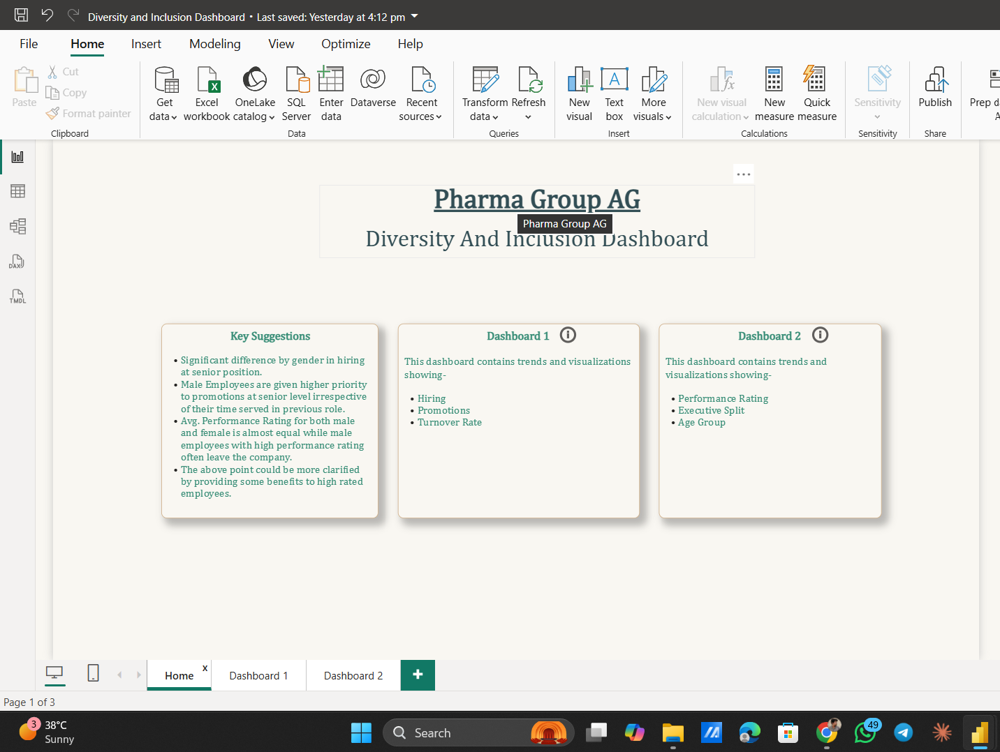
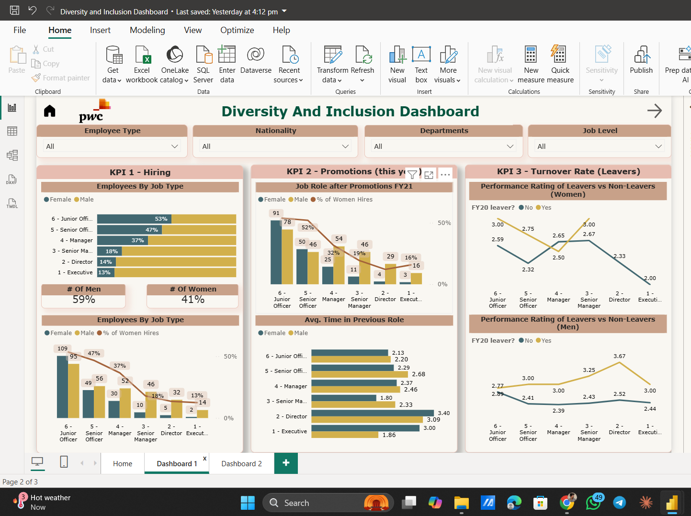
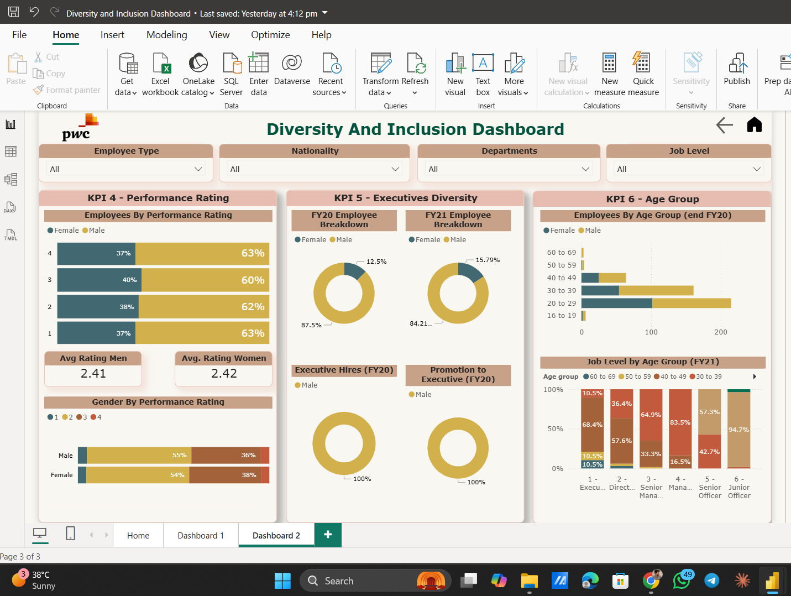

# 📊 Diversity & Inclusion Dashboard — Pharma Group AG
### *PwC Data Analytics Virtual Experience Program*

---

## 🧭 Overview

This project was developed as part of the **PwC Switzerland Power BI Virtual Experience Program** on Forage. The goal was to analyze Diversity & Inclusion (D&I) data for **Pharma Group AG** and build an interactive Power BI dashboard that helps HR leadership understand gender balance, promotion trends, turnover patterns, and executive representation.

The dashboard is structured across **3 pages** — a Home summary page and two deep-dive dashboard pages — each focused on specific KPIs.

---

## 🖼️ Dashboard Preview

### 🏠 Home Page


> The landing page provides **Key Suggestions** derived from the analysis, along with navigation cards to Dashboard 1 and Dashboard 2.

---

### 📋 Dashboard 1 — Hiring, Promotions & Turnover


> Covers **KPI 1 (Hiring)**, **KPI 2 (Promotions)**, and **KPI 3 (Turnover Rate / Leavers)**.

---

### 📋 Dashboard 2 — Performance Rating, Executive Diversity & Age Group


> Covers **KPI 4 (Performance Rating)**, **KPI 5 (Executive Diversity)**, and **KPI 6 (Age Group)**.

---

## 🔑 Key Performance Indicators (KPIs)

| KPI | Focus Area | Description |
|-----|-----------|-------------|
| KPI 1 | **Hiring** | Gender split across job levels (Junior to Executive) |
| KPI 2 | **Promotions (FY21)** | Job roles after promotions, % of women hires, avg. time in previous role |
| KPI 3 | **Turnover Rate** | Performance rating comparison of leavers vs non-leavers (by gender) |
| KPI 4 | **Performance Rating** | Avg. performance ratings by gender across rating levels |
| KPI 5 | **Executive Diversity** | Executive breakdown by gender (FY20 vs FY21), executive hires & promotions |
| KPI 6 | **Age Group** | Employee distribution by age group and gender; job level by age group |

---

## 💡 Key Insights

- **Significant gender gap in senior hiring** — male employees are disproportionately represented at senior and executive levels.
- **Promotions favor men** — male employees are given higher priority at senior levels, irrespective of their time served in their previous role.
- **Average performance ratings** are nearly equal for male and female employees (~2.41 vs 2.42).
- **High-performing male employees are more likely to leave** the company, suggesting a need for targeted retention strategies.
- **Executive roles remain predominantly male** — FY20 shows 87.5% male, with only marginal improvement in FY21 (84.21% male).
- **Younger age groups (20–39)** make up the largest workforce segment, with better gender balance at junior levels.

---

## 🛠️ Tools & Technologies

| Tool | Purpose |
|------|---------|
| **Power BI Desktop** | Dashboard creation and data visualization |
| **DAX** | Custom measures and calculated columns |
| **Power Query (M)** | Data transformation and cleaning |
| **Excel / CSV** | Source data |

---

## 📁 Project Structure

```
📦 PwC-Diversity-Inclusion-Dashboard
 ┣ 📊 Diversity_Inclusion_Dashboard.pbix   # Main Power BI file
 ┣ 📂 data/
 ┃ ┗ 📄 03 Diversity-Inclusion-Dataset.xlsx
 ┣ 🖼️ home_page.png
 ┣ 🖼️ dashboard1.png
 ┣ 🖼️ dash2.png
 ┗ 📄 README.md
```

---

## 📐 Dashboard Filters

All dashboards support cross-filtering via 4 global slicers:

- **Employee Type**
- **Nationality**
- **Departments**
- **Job Level**

---

## 🚀 How to Use

1. Clone or download this repository.
2. Open `Diversity_Inclusion_Dashboard.pbix` in **Power BI Desktop**.
3. If prompted, reconnect the data source to the provided Excel file in `/data`.
4. Explore the **Home**, **Dashboard 1**, and **Dashboard 2** tabs.

---

## 📌 Recommendations

Based on the analysis, the following actions are suggested for Pharma Group AG:

1. **Set measurable gender targets** for senior and executive-level hiring.
2. **Review promotion criteria** to ensure parity irrespective of time in role.
3. **Introduce retention programs** specifically targeting high-performing employees.
4. **Increase transparency** in promotion decisions to build employee trust.
5. **Track D&I KPIs quarterly** to monitor progress over time.

---

## 📬 Contact

Feel free to connect if you have questions or feedback about this project!

[](https://www.linkedin.com/in/tejascwaghmare/)
[](https://github.com/TCWaghmare/)
